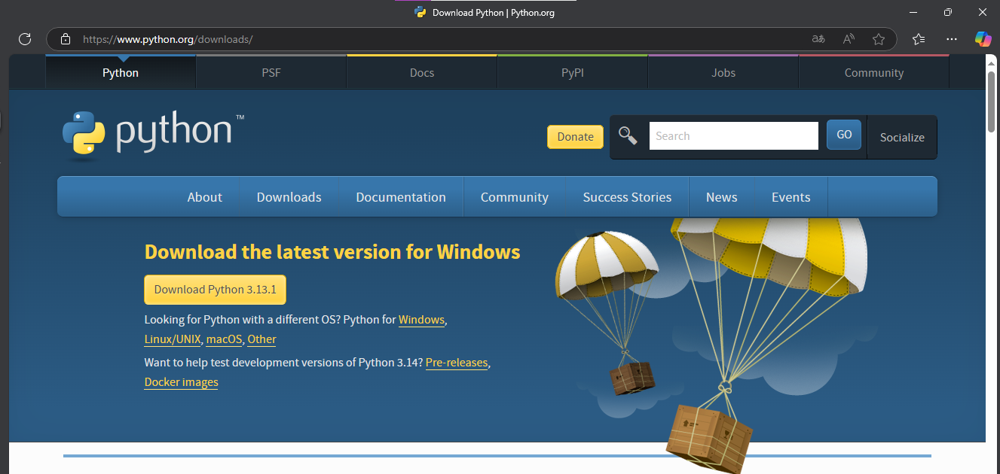
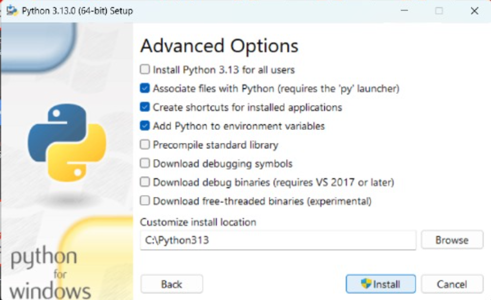

<!-- HOLA -->

#      MANUAL PARA INSTALAR PYTHON 
--- 
### Por: *Adriana Mariel cruz flores*
### Docente: *Said Jair Guerra Escudero*
### 

___
--- 
> ### **Paso 1: Buscar Python**

Abre tu navegador web y escribe "Python" en el buscador. Selecciona el enlace que corresponde a la página oficial de 
descargas de Python para Windows. Solo dale clic en donde dice Windows.
___
---
> ### **Paso 2: Descargar Python**

Al acceder a la página de descargas, serás redirigido a una sección que 
muestra la última versión de Python disponible para 
Windows. Para proceder con la descarga, haz clic en el botón 
amarillo correspondiente a la versión más reciente.
___
---
> ### **Paso 3: Descargando**

En la esquina superior de la pantalla, se puede observar una 
sección que muestra las descargas en curso. En esta área, se 
puede verificar que Python está siendo descargado.
___
---
> ### **Paso 4: Instalación de Python**

 Una vez completada la descarga, se abrirá 
una pantalla de instalación. En esta pantalla, se presentan dos opciones 
principales: **"Install Now"** (Instalar Ahora) y **"Customize Installation"**
(Personalizar Instalación).

* **Opciones Adicionales:** Debajo de estas opciones, hay dos casillas de 
verificación:
  + La primera casilla solicita permiso para usar privilegios de 
administrador durante la instalación.
  + La segunda casilla pregunta si se desea agregar Python a la variable 
de entorno PATH.

* **Configuración de Opciones:** Marca ambas casillas de verificación para 
permitir el uso de privilegios de administrador y agregar Python a la ruta del 
sistema.
Después de seleccionar estas opciones, haz clic en **"Install Now"** para 
iniciar la instalación.
___
---
> ### **Paso 5: Características Opcionales**

En la sección de **"Características Opcionales"**, mantén las opciones 
predeterminadas que aparecen por defecto. A continuación, haz clic en el 
botón "Next" para proceder a la siguiente página.
___
---

> ### **Paso 6: Intalando Python**

En la siguiente página, se presentan las opciones avanzadas 
de instalación. Mantén las opciones predeterminadas que 
aparecen por defecto. En la sección **"Customize install location"**
(Personalizar la ubicación de instalación), elimina las rutas 
adicionales y deja únicamente *C:\Python313*. Finalmente, haz clic 
en el botón **"Install"** para proceder con la instalación.
___
---

> ### **Paso 7: Intalando Python**

En la siguiente página, se presentan las opciones avanzadas 
de instalación. Mantén las opciones predeterminadas que 
aparecen por defecto. En la sección "Customize install location" 
(Personalizar la ubicación de instalación), elimina las rutas 
adicionales y deja únicamente C:\Python313. Finalmente, haz clic 
en el botón "Install" para proceder con la instalación.
___
---
## Configuración de las variables de Entorno

> ### **Paso 1:**

En el buscador de tu dispositivo, escribe la palabra *"sistema"*. Esto 
mostrará un icono de una máquina. Haz clic en *"Abrir"* para acceder a la 
configuración del sistema.
___
---
> ### **Paso 2:**

A continuación, se mostrará una pantalla que presenta las 
especificaciones del dispositivo junto con algunas configuraciones 
relacionadas. En esta sección, haz clic en **"Configuración 
avanzada del sistema"** para proceder.
___
---

> ### **Paso 3:**

Despues, se mostrará una ventana de **"Propiedades del sistema"**. 
En esta ventana, haz clic en el botón **"Variables de entorno"** para 
acceder a la configuración correspondiente.
___
---

> ### **Paso 4:**

Aparecerá una nueva ventana que muestra las variables de 
entorno. Localizala y selecciona la variable **Path** haciendo clic en 
ella para visualizar su contenido detalladamente.

___
---
> ### **Paso 5:**

Para confirmar que Python está instalado correctamente, se 
verifica que la ruta de Python aparezca en la variable de entorno 
**PATH**.

---
___

## Verificacón De La Instalación

Una forma de verificar la instalación de Python es utilizando el Símbolo del sistema **(cmd)**. 
Abre el Símbolo del sistema y escribe *python --version*, luego presiona Enter. Esto mostrará la versión 
de Python que está instalada en tu sistema.
